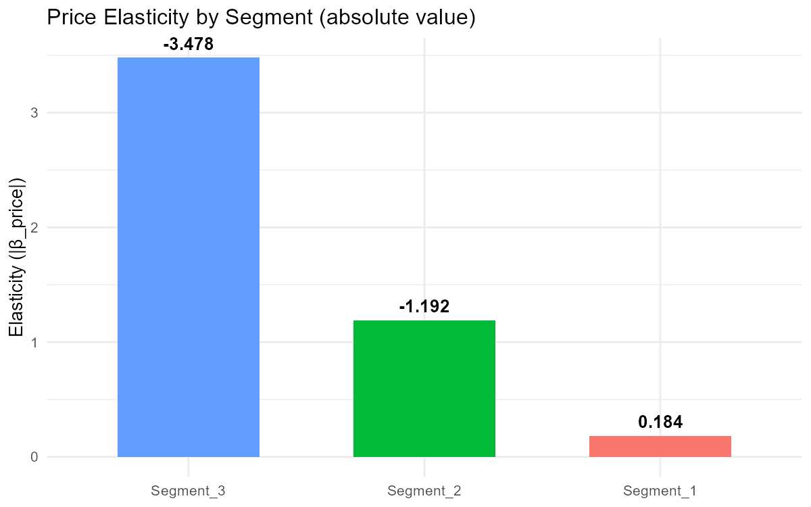
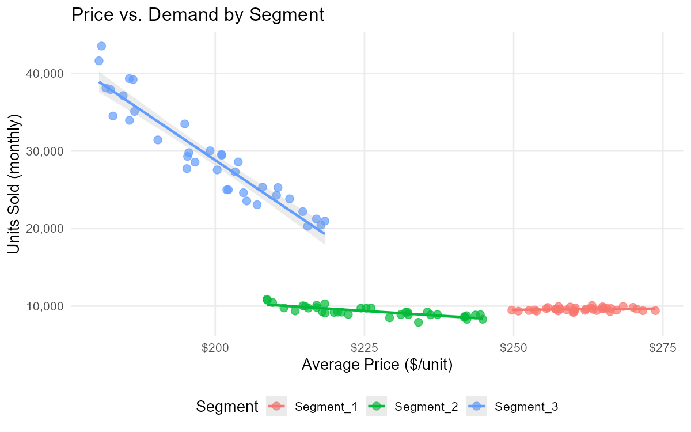
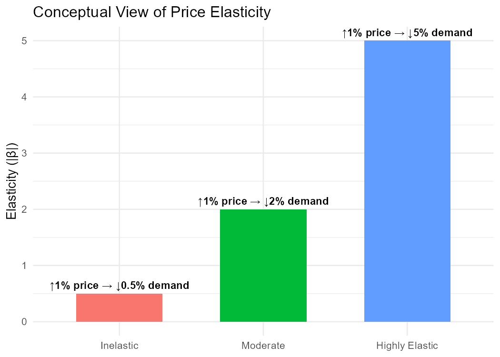

# Pricing_elasticity_modeling
Pricing project using simulated data to evaluate demand sensitivity, margin impact, and price–volume relationships across commercial segments. Includes elasticity modeling, visual analysis, and reproducible R scripts.

# Pricing Elasticity Modeling  
Log–log price elasticity modeling using synthetic data to evaluate demand sensitivity, margin impact, and price–volume relationships across commercial segments. This project replicates a real pricing workflow while protecting all confidential information.

---

## ⚠️ Disclaimer  
This repository uses fully anonymized and synthetically generated data.  
The original commercial dataset used in internal pricing evaluations is confidential and cannot be shared.  

To preserve confidentiality, a simulation engine was developed to recreate realistic demand behavior across segments (price variation, quantity response, elasticities, and noise).  
The methodology, modeling, and interpretation reflect the real workflow used to validate whether price adjustments were aligned with each segment’s demand behavior.

---

## 📊 Project Overview  
This project models the price–demand relationship for three commercial segments using a **log–log elasticity model**, a standard approach in pricing analytics.  
The goal is to identify how sensitive each segment is to price changes, quantify elasticity, and support margin and pricing strategy decisions.

The workflow includes:
- Synthetic market segmentation  
- Price and volume simulation with controlled elasticities  
- Log–log regression modeling  
- Elasticity estimation and statistical significance  
- Visual exploration of demand behavior  
- Business interpretation for pricing decisions  

---

## 🎯 Objectives  

### **1. Evaluate price sensitivity across segments**  
Different commercial segments may react differently to price changes.  
This model quantifies elasticities and identifies where pricing power exists.

### **2. Validate pricing decisions**  
Ensures that price changes are not implemented blindly but aligned with true demand behavior.

### **3. Provide visual and statistical insights**  
Using R, the project outputs visualizations that make elasticity patterns easy to understand for decision-makers.

### **4. Demonstrate a reproducible pricing analytics workflow**  
All modeling steps—from data generation to visualization—are transparent and reproducible.

---

## 🧠 Methodology

### **Modeling Approach: Log–Log Elasticity**
We estimate the following model:

\[
\log(Q) = \beta_0 + \beta_1 \log(P) + \epsilon
\]

Where:

- \( Q \) = Quantity sold  
- \( P \) = Price  
- \( \beta_1 \) = Price elasticity of demand  

Interpretation:  
- \( \beta_1 < -1 \) → elastic (price-sensitive)  
- \( -1 < \beta_1 < 0 \) → inelastic  
- \( \beta_1 = 0 \) → no relationship  

### **Simulated Elasticity Profiles**
To mimic real markets:

| Segment      | Expected Elasticity | Interpretation |
|--------------|---------------------|----------------|
| Segment_1    | ~ -0.25             | Stable, low sensitivity |
| Segment_2    | ~ -1.2              | Moderately price-sensitive |
| Segment_3    | ~ -3.5              | Highly price-sensitive (wholesale-like behavior) |

---

## 📈 Results Summary  

Based on the synthetic dataset:

### **Segment_1 — Inelastic (~0 to -0.2)**  
- Low sensitivity to price  
- Price increases have limited impact  
- Represents stable/retail-like demand  

### **Segment_2 — Elastic (~ -1.0 to -1.4)**  
- Moderate sensitivity  
- Represents project-based or B2B markets  

### **Segment_3 — Highly Elastic (~ -3.0 to -4.0)**  
- Extremely price-sensitive  
- Small price changes lead to large swings in volume  
- Typical of high-volume, low-margin channels  

These results reflect realistic pricing dynamics found in differentiated markets.

---
---

## 🖼 Visualization Outputs  

### **Elasticity by Segment**

### **Price–Demand Scatter**

### **Elasticity Concept (Illustrative)**

---

## 🛠️ Technical Stack  
- **R** (tidyverse, ggplot2, broom, lubridate)  
- **Synthetic data modeling** for confidentiality  
- **Log–log regression** for elasticity estimation  
- **Reproducible script workflow**  

---

## 📁 Repository Structure  

---

## 🇲🇽 Resumen en Español / Visualizaciones***********

Este análisis se desarrolló para evaluar si las decisiones de precio estaban alineadas con el comportamiento real de la demanda en distintos segmentos comerciales.

Debido a la sensibilidad del dataset original, se generaron datos sintéticos que imitan patrones reales de volumen, precio y margen, permitiendo reproducir el flujo analítico sin comprometer información confidencial.

El modelo de elasticidad precio–demanda ayuda a responder:

¿Qué tan sensible es cada segmento a cambios de precio?

¿Dónde existe poder de precio y dónde se debe actuar con cautela?

¿Cómo afecta un ajuste de precio al volumen y a la utilidad?

Este enfoque permite validar estrategias de pricing basadas en evidencia en lugar de supuestos.

---

## 📈 Elasticidad por Segmento (Valor Absoluto)

---

## 📉 Relación Precio–Demanda

---

## 📘 Concepto de Elasticidad (Ilustrativo)

---

